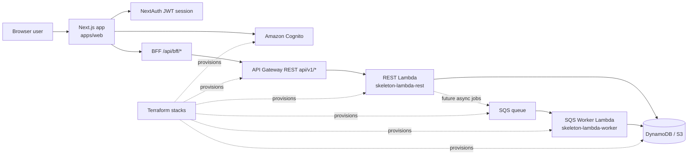

# Service Documentation

This repository ships a small serverless reference service made up of:

- `apps/web`: Next.js frontend, Cognito sign-in flows, and BFF routes
- `services/skeleton-lambda-rest`: API Gateway REST Lambda
- `services/skeleton-lambda-worker`: SQS-driven worker Lambda
- `infra/terraform`: environment, API Gateway, Lambda, Cognito, SQS, S3, and DynamoDB wiring

Use this docs set as the entry point for understanding the service shape and the request lifecycle:

- [Service Overview](./service/README.md)
- [API And Flows](./service/api/README.md)
- [CI/CD Setup](./ci-cd.md)

## Scope

The current backend service exposes four example routes under `/api/v1`:

- `GET /skeleton/health`
- `GET /skeleton/me`
- `GET /skeleton/admin`
- `GET /skeleton/private`

Terraform decides the first-line authorization mode for each route, while the Lambda can still apply deeper authorization checks such as Cognito group membership.

## High-level architecture

## Where auth happens

- Public routes use API Gateway `NONE`.
- User routes use API Gateway Cognito authorizers.
- Service-to-service routes can use API Gateway `AWS_IAM`.
- The REST Lambda can still reject authenticated callers, for example if `/skeleton/admin` is called by a user without the `admin` group.
