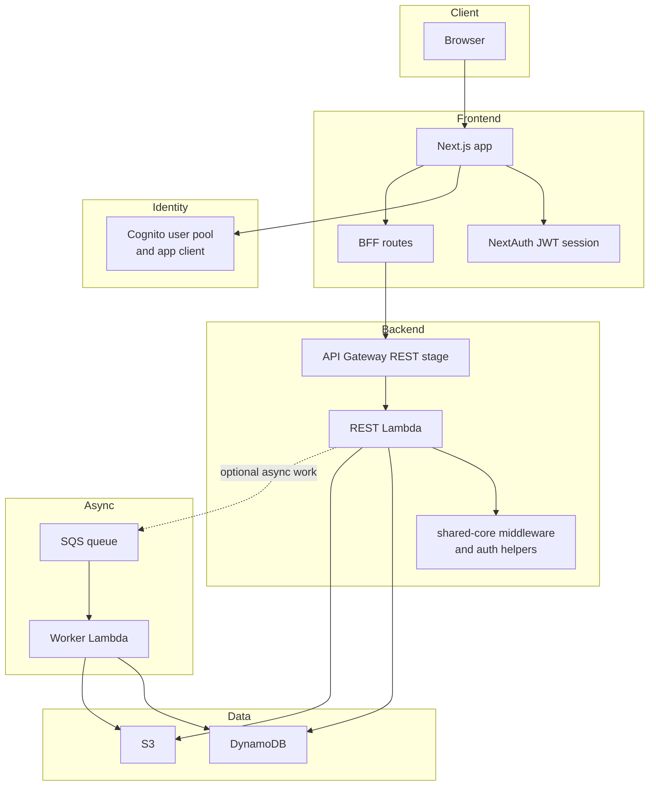
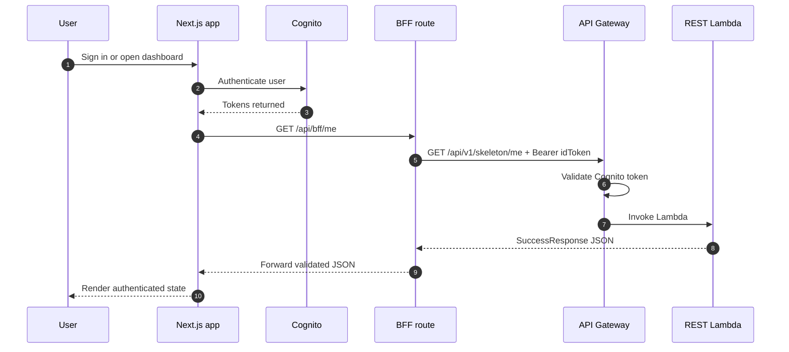

# Service Architecture

This page describes how the current reference service is assembled across frontend, backend, and infrastructure.

## Runtime building blocks

### Frontend

- `apps/web` is a Next.js application.
- It handles sign-up, verify-email, forgot-password, reset-password, and sign-in flows against Cognito.
- It also exposes BFF routes under `apps/web/src/app/api/bff/*` so the browser does not call the backend API directly for authenticated user flows.

### REST service

- `services/skeleton-lambda-rest` is an AWS Lambda fronted by API Gateway REST.
- The Lambda uses `aws-lambda-powertools` `APIGatewayRestResolver`.
- Shared middleware from `packages/python/shared-core` adds:
  - exception normalization
  - correlation IDs
  - request logging

### Worker service

- `services/skeleton-lambda-worker` is an SQS-triggered Lambda.
- It uses Powertools `BatchProcessor` so failed records are retried without replaying successful ones in the same batch.
- The current worker is scaffold-only and logs the parsed SQS payload.

### Infrastructure

- `infra/terraform/environment/*` composes the stack for each environment.
- `infra/terraform/stacks/core` provisions shared platform components such as Cognito.
- `infra/terraform/stacks/services` provisions:
  - REST Lambdas
  - worker Lambdas
  - API Gateway
  - SQS queues
  - CloudWatch log groups and alarms

## Component diagram

## Request lifecycle

## Authorization model

There are two layers:

1. API Gateway route authorization
2. Lambda-side authorization rules

Current route strategy:

| Route | API Gateway auth | Lambda-side rule |
| --- | --- | --- |
| `/api/v1/skeleton/health` | `NONE` | none |
| `/api/v1/skeleton/me` | `COGNITO` | reads caller claims |
| `/api/v1/skeleton/admin` | `COGNITO` | requires Cognito `admin` group |
| `/api/v1/skeleton/private` | `AWS_IAM` | requires IAM identity context |

## Deployment shape

`infra/terraform/stacks/services/main.tf` converts service route declarations into API Gateway integrations by:

- prepending the shared API base path `/api/v1`
- selecting one of `NONE`, `COGNITO`, or `AWS_IAM` per route
- attaching the route to the target Lambda
- enabling stage-level logging, metrics, tracing, and throttling

That means the service code owns handler behavior, but Terraform owns the public contract surface and authorization mode at the gateway edge.

## Important caveat

The browser-facing BFF can call the Cognito-protected backend routes because it forwards a Cognito token. The IAM-only route is different: a plain browser fetch cannot satisfy API Gateway `AWS_IAM` authorization. That route is intended for signed AWS service-to-service access unless the app later introduces SigV4 signing on the caller side.
