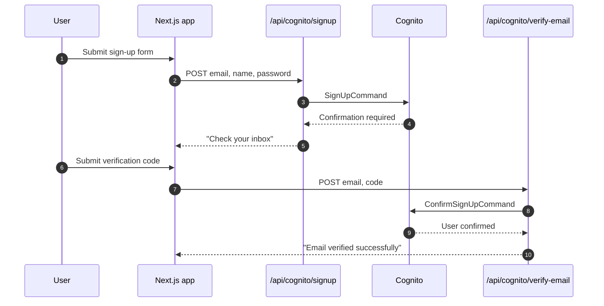
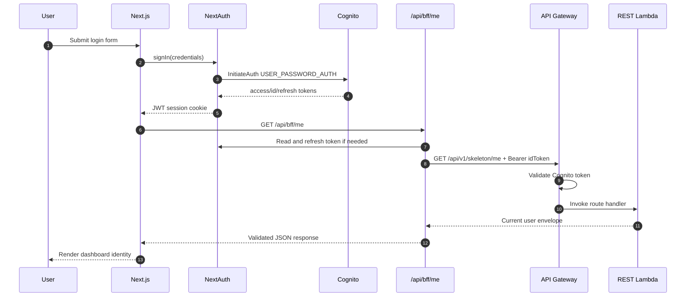
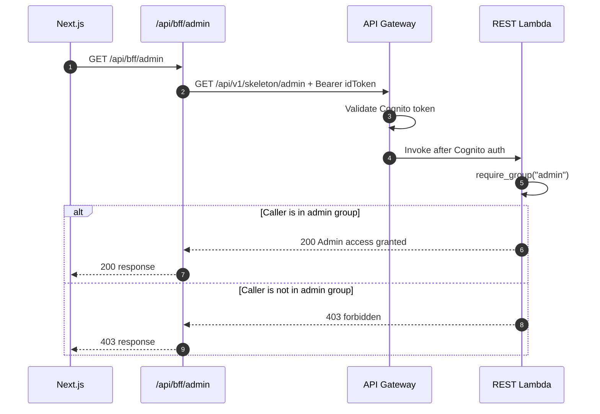
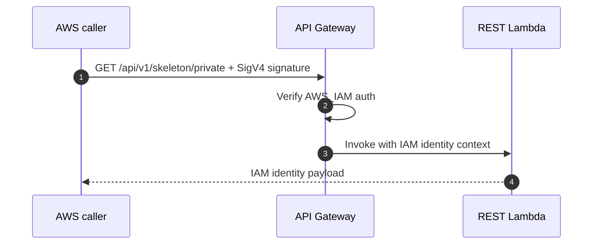

# API And End-to-End Flows

This page documents the current example API, the response contracts, and the end-to-end request paths from frontend to backend.

## Base URL

- API Gateway base path: `/api/v1`
- Frontend env var: `APP_API_BASE_URL`
- Example deployed base URL:

```text
https://<api-id>.execute-api.<region>.amazonaws.com/<stage>/api/v1
```

## Response envelopes

Successful backend responses follow the shared success envelope:

```json
{
  "message": "OK",
  "data": {}
}
```

Errors follow the shared error envelope:

```json
{
  "code": "unauthorized",
  "message": "Authentication is required for this endpoint.",
  "details": []
}
```

The TypeScript mirror for these shapes lives in `packages/contracts/src/api.ts`.

## Route reference

| Method | Path | Auth | Purpose |
| --- | --- | --- | --- |
| `GET` | `/api/v1/skeleton/health` | public | service health and version |
| `GET` | `/api/v1/skeleton/me` | Cognito identity token | current caller identity |
| `GET` | `/api/v1/skeleton/admin` | Cognito identity token + `admin` group | admin example |
| `GET` | `/api/v1/skeleton/private` | AWS IAM | service-to-service example |

## Endpoint details

### `GET /api/v1/skeleton/health`

Purpose:
Returns the deployed service name, version, and environment.

Example response:

```json
{
  "message": "OK",
  "data": {
    "version": "1.0.0",
    "service": "saas-template-dev-skeleton-rest",
    "environment": "dev"
  }
}
```

### `GET /api/v1/skeleton/me`

Purpose:
Returns the Cognito identity claims surfaced by API Gateway after Cognito token validation.

Example response:

```json
{
  "message": "Authenticated user loaded.",
  "data": {
    "subject": "6e6f...",
    "username": "person@example.com",
    "email": "person@example.com",
    "groups": [
      "admin"
    ]
  }
}
```

### `GET /api/v1/skeleton/admin`

Purpose:
Shows the pattern for gateway-authenticated routes that still need role checks in Lambda.

Behavior:

- API Gateway first validates the Cognito token.
- API Gateway first validates the Cognito token.
- The Lambda then checks for membership in the `admin` group.
- Non-admin callers receive a forbidden error from the application layer.

Example response:

```json
{
  "message": "Admin access granted.",
  "data": {
    "subject": "6e6f...",
    "username": "person@example.com",
    "role": "admin"
  }
}
```

### `GET /api/v1/skeleton/private`

Purpose:
Demonstrates a route protected by API Gateway `AWS_IAM`.

Behavior:

- The caller must send a SigV4-signed request.
- API Gateway injects IAM identity context.
- The Lambda returns a normalized view of the calling principal.

Example response:

```json
{
  "message": "IAM access granted.",
  "data": {
    "account_id": "123456789012",
    "access_key": "ASIA...",
    "caller": "AROA...",
    "source_ip": "10.0.0.1",
    "user": "svc-example",
    "user_arn": "arn:aws:sts::123456789012:assumed-role/example/svc"
  }
}
```

## Frontend-to-backend flows

### Flow 1: Sign up and verify email



### Flow 2: Sign in and load current user



### Flow 3: Admin check



### Flow 4: Private service-to-service route



Browser note:
The current `apps/web/src/app/api/bff/private/route.ts` proxy does not sign requests with SigV4, so it should be treated as placeholder scaffolding rather than a working browser flow for the IAM-protected route.

## End-to-end authorization matrix

| Flow | Caller token/mechanism | Gateway decision | Lambda decision |
| --- | --- | --- | --- |
| Health | none | allow | return health payload |
| Me | Cognito bearer token | validate token | return claims |
| Admin | Cognito bearer token | validate token | require `admin` group |
| Private | IAM SigV4 | validate AWS principal | return identity context |

## Implementation references

- REST app wiring: `services/skeleton-lambda-rest/src/skeleton_lambda_rest/api/app.py`
- Route registration: `services/skeleton-lambda-rest/src/skeleton_lambda_rest/handler.py`
- Auth helpers: `packages/python/shared-core/src/shared_core/auth.py`
- Contracts: `packages/contracts/src/api.ts`
- Current user schema: `packages/contracts/src/auth.ts`
- BFF proxy: `apps/web/src/lib/api/backend-proxy.ts`
- NextAuth token refresh: `apps/web/src/lib/auth/token.ts`
